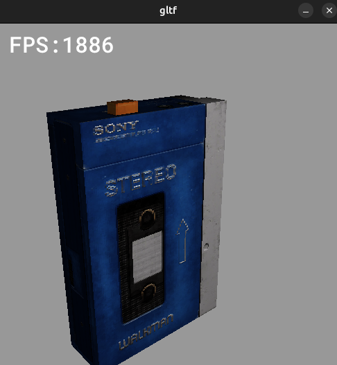

# My Computer Engine

A basic graphics library using Vulkan that can be used to make simple games.

## Ideas behind the library:

* vulkan/fixed-function hardware
* raylib-like

## Goals:
- [x] work on desktop
- [ ] work on meta quest
- [ ] can be used to make simple game

## Examples

